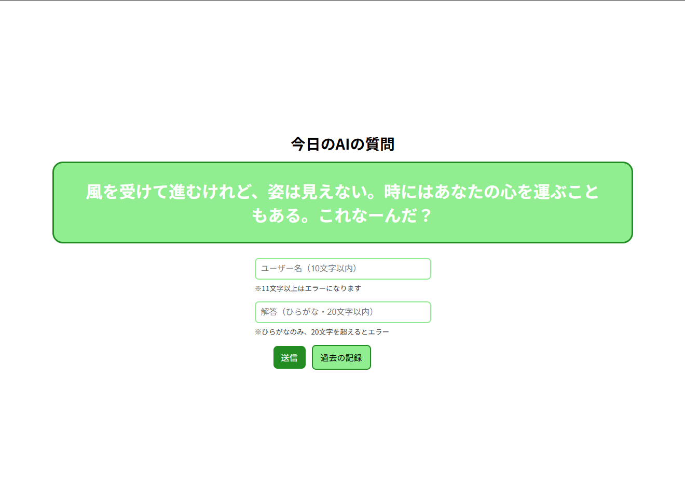

# The-8-PM-Challenge

## Link
Pages Link Here !! -> (https://h4aruki.github.io/The-8-PM-Challenge/)

## Overview
AIが考えたなぞなぞに正解することを目指すだけのシンプルなゲームです。ただし、使用しているAIは古いモデルで、よく謎めいた問題と解答を提示してきます。ユーザーは、その謎めいた問題の答えをAIが想定したとおりに解答する必要があります。問題の公開は毎日PM8時(*1)で、公開から正解までの時間が短い上位10名の名前が、正解発表と同時に表示されます。

*1 ：GASでトリガーを設定しての実行なので、ジャスト20時ではなく、20時から20時15分の間です。

    

## Background
技育キャンプハッカソン2025 vol.12にて開発しました。

2024年にリリースされた、AIとチャットしながらリアルタイムで尋問するゲーム「ドキドキAI尋問ゲーム」からインスピレーションを得て、AIと対決するWebアプリを開発することにしました。当時はまだAIの精度が高くないことはわかっていたため、その状況を利用して、AIが考えためちゃくちゃななぞなぞに挑戦する仕様はおもしろいのではないかというのがこのサイトを開発した背景です。

## Design Documentation
設計書はNotionページにて管理しているため、そちらを添付します。

https://hurricane-dance-850.notion.site/25f605b98b4f80c180afe5b8e7b3f352?source=copy_link

## Build With
### Frontend

### Backend

### DataBase

### CI/CD

### Document

## Contributors ✨
<table>
    <tr>
        <td align="center">
            <a href="https://github.com/H4aruki">
                 
                <b>H4aruki</b>
            </a> 
            <a href="https://github.com/H4aruki/MyTechPulse/commits?author=H4aruki" title="Code">💻</a>
            <a href="https://github.com/H4aruki/MyTechPulse/commits?author=H4aruki" title="Construction">🚧</a>
            <a href="https://github.com/H4aruki/MyTechPulse/commits?author=H4aruki" title="Design">🎨</a>
        </td>
        <td align="center">
            <a href="https://github.com/KaichoHarry">
                 
                <b>はりぃ会長</b>
            </a> 
            <a href="https://github.com/H4aruki/MyTechPulse/commits?author=KaichoHarry" title="Code">💻</a>
            <a href="https://github.com/H4aruki/MyTechPulse/commits?author=KaichoHarry" title="Construction">🚧</a>
            <a href="https://github.com/H4aruki/MyTechPulse/commits?author=KaichoHarry" title="Ideas">🤔</a>
            <a href="https://github.com/H4aruki/MyTechPulse/commits?author=KaichoHarry" title="Design">🎨</a>
        </td>
        <td align="center">
            <a href="https://github.com/departiment">
                 
                <b>榎並みみみみみみみ</b>
            </a> 
            <a href="https://github.com/H4aruki/MyTechPulse/commits?author=KaichoHarry" title="Code">💻</a>
            <a href="https://github.com/H4aruki/MyTechPulse/commits?author=KaichoHarry" title="Construction">🚧</a>
            <a href="https://github.com/H4aruki/MyTechPulse/commits?author=KaichoHarry" title="Design">🎨</a>
        </td>
    </tr>
</table>